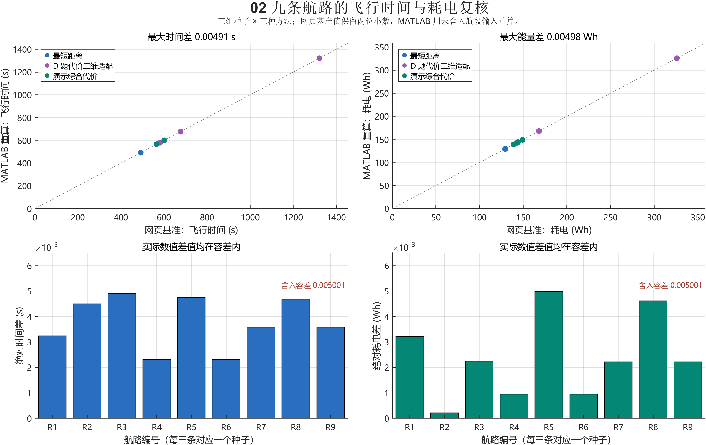
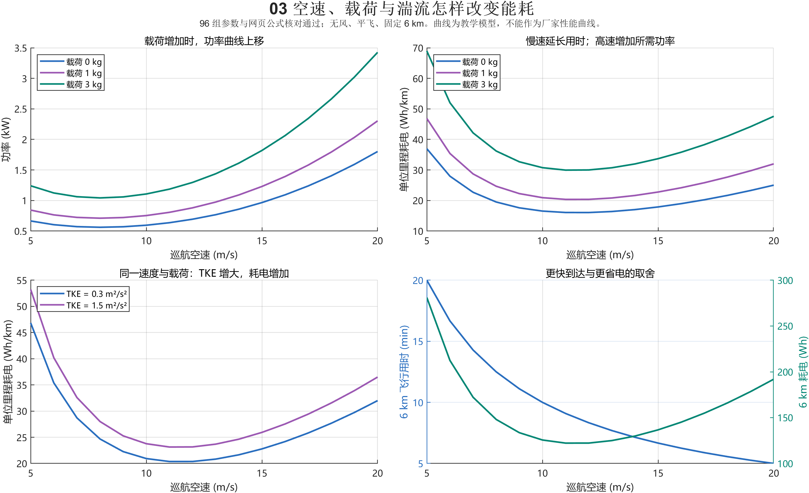
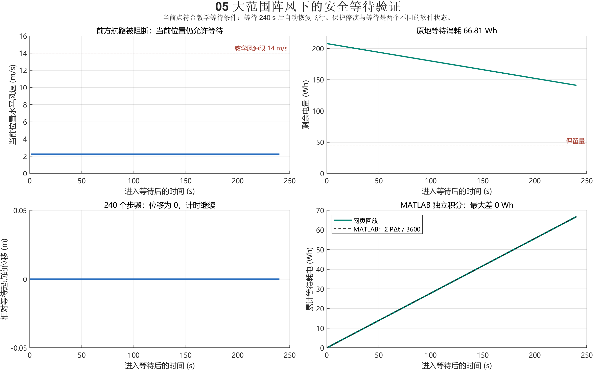

# 低空航路演示数学模型推导与程序正确性验证

本说明用于低空经济技术与实践课程汇报，回答三个问题：公式依据是什么，网页和 MATLAB 是否正确实现公式，以及现有结果能支持什么结论。我们以当前二维定高程序为对象，分别说明物理定义、已有研究的方法和自行设定的教学参数。

结论是：地速关系、TKE 定义、功率积分和电量账本有明确推导；在非负边权和一致启发函数条件下，单次网格 A* 有最优性依据；MATLAB 已通过独立计算和可手算算例。当前耗电系数、合成风场及飞行限值尚未用实测数据标定，因此支持教学软件的内部正确性，不能宣称已证明真实飞机的性能或运行安全。

## 1 模型范围和符号单位

规划网格为 61×41 个节点，间距 200 m，覆盖约 12×8 km 的教学区域；固定高度 300 m。更大的地图显示范围不自动扩大规划区域。航段内把风、TKE 和功率近似为常值，不求解姿态、加速度、爬升或旋翼流场。

| 符号 | 含义 | 单位或约定 |
|---|---|---|
| d 与 d_km | 航段长度 | m 与 km 严格区分 |
| v_a 与 v_g | 空速与沿航路地速 | m/s |
| u v w | 三方向风速 | m/s；向东向北为正 |
| k 与 k_ref | TKE 与参考 TKE | m²/s²；k_ref=3 |
| σ 与 σ² | 脉动标准差与方差 | m/s 与 m²/s² |
| m_0 与 m | 演示空载质量与载荷 | kg；m_0=5.5 |
| P 与 E | 功率与消耗能量 | W 与 Wh |
| B C B_res | 剩余能量 容量 保留能量 | Wh；默认 C=220 |
| G | 归一化阵风指标 | 无量纲；不是风速 |
| t 与 τ | 任务时间与天气时间 | s 与 min |

默认空速 12 m/s，载荷 1 kg，初始电量 95%，保留电量 20%，换电 120 s。路径对比实验另采用 6 km 起终点间距、1000 Wh 容量、关闭换电；换电回放使用默认任务。两类设置不能混用。

公式成立、代码实现正确、模型符合实测是三个层次。若两套代码使用同一错误假设，数值一致也不能排除模型错误，因此需要推导、量纲、手算答案和外部数据共同组成证据。

<!-- pagebreak -->
## 2 TKE 与风速波动的联系

瞬时风速分解为平均风和零均值脉动。TKE 是单位质量的脉动动能，不是平均风速平方。NOAA 官方资料给出其与三个分量方差的定义 [1]。

$$
u=\bar u+u',\quad v=\bar v+v',\quad w=\bar w+w'
$$

$$
k=\frac12\left(\overline{u'^2}+\overline{v'^2}+\overline{w'^2}\right)=\frac12(\sigma_u^2+\sigma_v^2+\sigma_w^2)
$$

演示增加局部各向同性假设，即三方向方差相同，故波动幅度可直接解出。各向同性是简化条件，城市建筑附近不普遍成立。

$$
\sigma_u^2=\sigma_v^2=\sigma_w^2=\sigma^2\quad\Longrightarrow\quad \sigma=\sqrt{\frac{2k}{3}}
$$

代码采用四个随机相位正弦模式。对固定位置和固定 k，若相位独立均匀分布，单个正弦均值为 0、方差为 1/2；归一化模式和的方差为 1。

$$
Z_j=\sqrt{\frac2N}\sum_{n=1}^{N}\sin(\theta_n+\phi_{nj}),\quad N=4
$$

$$
\mathbb E[Z_j]=0,\quad \operatorname{Var}(Z_j)=\frac2N\,N\,\frac12=1,\quad u'_j=\sigma Z_j
$$

这解释了模型规定的波动方差为什么与 k 相容。例如 k=0.3 时 σ=√0.2≈0.44721 m/s；k=1.5 时 σ=1 m/s。随机相位理想分布的推导，不保证固定种子、有限时间窗或随时间变化的 k 所产生的样本方差恰好等于规定值。页面方差属于规定量，不是实测窗口估计量。

平均风与湍流可以关联，但不存在仅凭平均风速唯一确定 TKE 的通用公式。程序用共享 k 调整波动幅度，再叠加平均风与阵风，保持显示的一致性；未求解流体动力学，也未标定城市湍流谱。这不是 Dryden 模型。MathWorks 官方 Dryden 文档可作为未来速度谱和滤波器的对照，但也有冻结湍流等适用限制 [2]。

对应代码：seeded-weather.js 的 wind；weather-physics.js 的 diagnostics 与 windSample。解析检查核对 k 与 σ 的代数关系，尚未验证整个随机场的实测谱和相关长度。

<!-- pagebreak -->
## 3 合成气象场和多源融合推导

自然湍流斑块有随机位置、尺度、开始和结束时间。时间包络在起止处为零，中间达到峰值；空间采用旋转高斯核，斑块随平均风平移。

$$
a(t)=\sin^2\left(\pi\frac{t-t_s}{t_e-t_s}\right),\quad t_s<t<t_e
$$

$$
k_{true}=\min\left(3,\ 0.07+\sum_l K_l a_l(t)\exp[-(A_l^2+B_l^2)/2]H(z)\right)
$$

区间外 a=0；A_l 和 B_l 为按尺度归一化后的旋转坐标；H(z)=0.85+0.15 cos((z−300)/350)。天气时间用 min、坐标用 km，平移项系数 0.06 来自 60/1000。高度函数、斑块参数和 k 上限仍是教学设定。

“雷达”“风廓线”“地面站”是对合成 TKE 场加噪声的代理观测，未实现真实雷达谱宽到 TKE 的反演。课程第二份 PDF 仅作为融合思路参考 [12]。在网格点把局部 TKE 视为共同未知量 q，用给定正权重构造平方误差：

$$
L(q)=\sum_i w_i(q-y_i)^2,\quad L'(q)=2\sum_i w_i(q-y_i)=0
$$

$$
\hat k=\frac{\sum_i w_i y_i}{\sum_i w_i},\quad L''(q)=2\sum_i w_i>0
$$

因此至少一个权重大于零时，加权平均是这个明确目标的唯一最小值；归一化权重非负、和为一，结果位于观测最小和最大值之间。无观测时输出 NaN，不能把缺测当作零湍流。

$$
w_i=\frac{\exp(-D_i^2/R_i^2)\exp(-a_i/15)}{(D_i^2+0.08^2)s_i^2}
$$

D_i 由 km 距离与 2.5 倍伸缩的高度差构成，R_i 为 km，a_i 是名义资料年龄 min。只能证明给定权重下的代数最优化；核宽、年龄衰减、名义噪声和高度伸缩未用传感器误差标定，不能称为真实多源融合的统计最优估计。

手动阵风采用 b(r)=(1−r²)²，r<1，区间外为零；叠加风矢量、TKE 增量与 G。每处默认 240 s，最后 60 s 衰减。这些增量是演示规则，未从完整湍流能量收支推导。

对应代码：seeded-weather.js 的 envelope 和 reference；model.js 的 observations 和 buildField；weather-physics.js 的 decorate。融合及天气生成未在 MATLAB 独立重写，不能把航路复核当成真实气象反演验证。

<!-- pagebreak -->
## 4 空速地速与侧风补偿推导

FAA 手册的风三角给出空速、风速和地速关系 [3]。沿航段单位向量为 e，侧向单位向量为 n。这里风矢量表示吹向方向；气象“风来自哪里”的角度需先转换。

$$
\boldsymbol v_g=\boldsymbol v_a+\boldsymbol w,\quad \boldsymbol e=\frac{(\Delta x,\Delta y)}{\sqrt{\Delta x^2+\Delta y^2}}
$$

$$
w_{\parallel}=\boldsymbol w\cdot\boldsymbol e,\quad w_{\perp}=\boldsymbol w\cdot\boldsymbol n
$$

不横向漂移要求地速侧向分量为零，所以空速侧向分量抵消侧风。固定空速模长后，勾股关系给出前向分量：

$$
v_{a,\perp}=-w_{\perp},\quad v_{a,\parallel}^2+w_{\perp}^2=v_a^2
$$

$$
v_g=\sqrt{v_a^2-w_{\perp}^2}+w_{\parallel},\quad |w_{\perp}|<v_a
$$

正平方根代表空速朝航段前方。侧风达到空速时本模型拒绝航段；逆风使 v_g≤0 时无法前进。演示还设 v_g≥3 m/s、水平风速小于 14 m/s；这两个值不是风三角推导结果，也不是已核实的机型厂家限制。

手算：空速 12 m/s，向东。无风地速 12；6 m/s 顺风为 18；6 m/s 逆风为 6；6 m/s 侧风为 √108≈10.3923。12 m/s 侧风或逆风会被拒绝。14 m/s 顺风虽有正地速，也因教学风限被拒绝。

假设飞机可立即完成偏航补偿并维持空速。公式是运动学关系，不代表真实多旋翼有足够推力、倾角及控制余量。真实约束需加入姿态、加速度与厂家风限。

程序沿航段按约 50 m 或更小间距采样安全条件，同时阻止对角线穿越被拒绝的相邻网格。采样减少漏检，但无梯度界和误差界时，不能证明采样点之间绝无危险。

对应代码：weather-physics.js 的 edge、safePoint、safeSegment；MATLAB verify_demo.m 的投影和地速检查；verify_analytic_cases.m 的七个闭式算例。

<!-- pagebreak -->
## 5 载荷和速度功率关系的依据

载荷影响可从理想旋翼悬停动量理论解释。假设不可压缩定常流、均匀桨盘、固定总面积 A 与密度 ρ；远前方速度为零，桨盘诱导速度 v_i，远尾流为 2v_i。连续性和动量守恒给出推力，推力乘诱导速度给出功率。NASA 资料介绍了桨盘动量理论 [4]。

$$
\dot m_{air}=\rho A v_i,\quad T=\dot m_{air}(2v_i)=2\rho A v_i^2
$$

$$
P_{ind}=Tv_i=\frac{T^{3/2}}{\sqrt{2\rho A}}
$$

悬停 T=(m_0+m)g_acc，固定其他条件，诱导功率随总质量的 3/2 次方变化：

$$
\frac{P_{ind}(m_0+m)}{P_{ind}(m_0)}=\left(\frac{m_0+m}{m_0}\right)^{3/2}
$$

这解释理想诱导功率趋势。程序把该缩放用于整个基准推进功率，是进一步的教学近似，不等于真实整机功率都遵循 3/2 次方。

阻力 D=(1/2)ρ C_D A_f v_a²，故阻力功率 Dv_a 含 v_a³ 项。Zeng 等正式发表的旋翼研究区分型阻、诱导和寄生阻力，其高速近似含常数、v_a²、1/v_a、v_a³ 项 [5]：

$$
P_{ref}(v_a)\approx P_0\left(1+\frac{3v_a^2}{U_{tip}^2}\right)+\frac{P_i v_0}{v_a}+\frac12 d_0\rho sA v_a^3
$$

P_0 与 P_i 是论文的悬停功率参数，U_tip 为桨尖速度，v_0 为悬停诱导速度，d_0 和 s 为阻力及旋翼参数。此近似有 v_a 远大于 v_0 等条件，不能外推到悬停。本演示未提供这些机型参数，也没有逐项实现完整论文公式。

当前速度因子 0.2+0.3/x+0.5x³ 只借鉴下降项与高速上升项的结构，f(1)=1 方便保持基准速度。0.2、0.3、0.5 并非从论文直接推导或实测拟合，不能称为有误差界的气动近似。

对应代码：weather-physics.js 的 basePower、speedFactor、power。文献支持结构和研究方向，不为当前 650 W、5.5 kg 参数提供机型认证。

<!-- pagebreak -->
## 6 当前功率公式和速度取舍

先定义质量与速度项，再叠加 TKE、水平风与阵风附加功率：

$$
P_b=P_{base}\left(\frac{m_0+m}{m_0}\right)^{3/2},\quad x=\frac{v_a}{12\ \mathrm{m/s}},\quad f(x)=0.2+\frac{0.3}{x}+0.5x^3
$$

$$
P=P_b f(x)\left[1+0.6\left(\frac{k}{k_{ref}}\right)^2\right]+c_w W_h^2+c_G G^2+P_{aux}
$$

P_base=650 W，k_ref=3 m²/s²，W_h=√(u²+v²)，c_w=4 W·s²/m²，c_G=220 W，P_aux=40 W。括号各项无量纲；所有附加项单位均为 W。G 不是 m/s。

在允许参数范围，功率为正；载荷、k、风幅度或 G 增加时相应项增加。平方惩罚及 0.6、4、220、40 都是教学系数，量纲一致和趋势合理不能证明真实耗电准确。

最低功率速度满足 f 的导数为零，二阶导数为正：

$$
f'(x)=-\frac{0.3}{x^2}+1.5x^2=0,\quad f''(x)=\frac{0.6}{x^3}+3x>0
$$

得 x=0.2^(1/4)，即约 8.02488 m/s。配送还关心单位距离耗电。无风时设 A=P_b[1+0.6(k/k_ref)²]，则：

$$
q(x)=\frac{A f(x)+40}{43.2x},\quad q'(x)=\frac{-(0.2A+40)/x^2-0.6A/x^3+Ax}{43.2}
$$

对 x>0、A>0，二阶导数恒正；q 在速度趋近零或无穷时都增大，因此导数零点是唯一最低点。

$$
q''(x)=\frac{2(0.2A+40)/x^3+1.8A/x^4+A}{43.2}>0
$$

$$
A x^4-(0.2A+40)x-0.6A=0
$$

载荷 1 kg、k=0.3、无风无阵风时，MATLAB 解得最低 Wh/km 速度约 11.47731 m/s。两个极小值不同，是功率与单位距离能量目标不同所致，都是教学函数结果，不是实机推荐速度。

逆风使地速降低，增加同航程的时间与能量。当前 4W_h² 对等大小顺逆风相同，属于现象性惩罚；不能解释成空气动力学上二者功率必然相同，真实模型需标定并避免重复计入风影响。

巡航式含 1/v_a，不能代入零速度。悬停另用教学常数 1.08 替换 f；未保证低速到悬停连续过渡，这是模型改进点。

<!-- pagebreak -->
## 7 时间积分电量与换电账本

正地速、段内近似常值时，距离除以地速给出时间。功率是能量变化率；1 Wh=3600 J，所以积分需除以 3600。

$$
\Delta t_i=\frac{1000d_{km,i}}{v_{g,i}},\quad E_{Wh}=\frac1{3600}\int_0^T P(t)\,dt
$$

$$
E_i=\frac{P_i\Delta t_i}{3600},\quad E_{flight}=\sum_i E_i,\quad q_i=\frac{P_i}{3.6v_{g,i}}\ \mathrm{Wh/km}
$$

分段常功率下和式是该分段模型的准确积分；对真实变化功率则是近似。飞行与等待按实际步长扣电，不能每帧扣固定百分比。

$$
B_{n+1}=B_n-\frac{P_n\Delta t_n}{3600},\quad B_n\ge B_{res}=C\frac r{100}
$$

换电地面停留固定时间，换成满电电池；旧电池剩余能量不是消耗量。新增能量为新旧电池能量差；累计 usedWh 不因换电清零。

$$
B^+=C,\quad R=C-B^-,\quad B_{final}=B_0+\sum_j R_j-E_{used}
$$

$$
T_{task}=T_{flight}+T_{hold}+N_{swap}t_{swap}
$$

播放倍率只影响演示墙钟时间。页面暂停和保护停演冻结模拟，不代表真实飞机免费悬停。进入安全位置等待后位置不变，悬停仍扣电；等待点不安全或触及保留电量则停止模拟，尚未模拟真实返航或备降。

手算：零载荷、k=0、无风、12 m/s 时，P=690 W；6 km 用时 500 s，耗电 95.83333 Wh。悬停 P_h=650×1.08+40=742 W；120 s 耗电 24.73333 Wh，均已与网页输出闭式核对。

账本例：B_0=209 Wh，第一段耗电 50 后剩 159，换电补入 61，第二段耗电 100 后剩 120，满足 209+61−150=120；每段末均超过 44 Wh。该例检查算术；实际任务状态另用 1031 个回放点审计。

对应代码：weather-physics.js 的 edge 和 hoverPower；flight-engine.js 的 tick 和 schedule；MATLAB 的逐段复算、悬停积分与账本恒等式。

<!-- pagebreak -->
## 8 路径目标与 A 星最优性条件

演示路线与课程 D 题适配路线目标不同，须分别报告。以端点平均 TKE 代表航段，演示目标组合距离、归一化 TKE 与能量：

$$
\bar k_i=\frac{k_i+k_{i+1}}2,\quad c_{demo,i}=d_{km,i}\left[1+\lambda\left(\frac{\bar k_i}{k_{ref}}\right)^2\right]+\eta\frac{E_i}{E_{ref}}
$$

λ=8、η=2。代码 E_ref 数值 20，带量纲时应解释为 20 Wh/km，使能量项折算为 km 等效代价；这不是实际新增航程。

课程第一份 PDF 第 28–29 页定义距离加 TKE 幂次惩罚，α=200、β=1.5 [11]。实验仅二维定高适配。为保持量纲，可把原 SI 数值解释为以 k_star=1 m²/s² 为参照：

$$
c_{D,i}=d_{km,i}\left[1+200\left(\frac{\bar k_i}{k_{star}}\right)^{1.5}\right],\quad k_{star}=1\ \mathrm{m^2/s^2}
$$

参照解释保持计算数值不变，不额外验证原文参数来源。D 题 PDF 标为课程材料，未作为正式论文。该目标的最优路径不一定最快、最省电或换电最少。

在 λ、η、k、E 非负时，c_i≥d_i。取 h 为到目标的直线距离，则三角不等式给出每条允许有向边：

$$
h(n)\le d(n,m)+h(m)\le c(n,m)+h(m),\quad h(goal)=0
$$

因此 h 一致且不高估剩余代价。在固定有限图、非负权、正确维护优先队列和累计代价条件下，A* 弹出目标可得离散最小代价，依据 Hart 等研究 [6]。代码使用 closed 集而不重开节点，需要上述一致性。能量单目标不一定 c≥d，所以代码关闭距离启发，取 h=0，退化为 Dijkstra [7]。

删除不可飞节点或边不破坏剩余边的不等式。顺逆风使两方向可行性可能不同，所以 MATLAB 用 digraph。正权 shortestpath 采用 Dijkstra [8]，重新算 D 题权重与最优值；比较总代价，不强求等价最优路线坐标相同。

证明只针对给定离散图。相同安全边集的验证不能证明没有遗漏真实禁飞空域、建筑物，或连续空间路径已全局最优。

<!-- pagebreak -->
## 9 换电网络滚动规划与边界

上层节点包括当前位置、下一必经点、终点及三个换电站。必经点按顺序推进，换电站为可选节点。标签包含位置、任务进度、剩余能量和累计等效代价：

$$
s=(p,j,B,J),\quad B_{arrival}=B-E(p,q)\ge B_{res}
$$

满足保留能量才扩展；到站换成满电。换电惩罚用空速把服务秒数折算为距离，当前并非只最小化总任务时间。

$$
J_{new}=J+c_{route}+\mathbb1_{swap}\frac{t_{swap}v_a}{1000}
$$

同位置同进度、固定气象、无到达时刻相关约束、站点一直可用时，代价更低且电量更多的标签支配另一标签，可以剪枝：

$$
J_A\le J_B,\quad B_A\ge B_B\quad\Longrightarrow\quad A\ \mathrm{dominates}\ B
$$

每对节点仅提供综合代价路线与最低能量路线两类候选，未枚举全部折中路径。因此不能宣称整个换电任务在全部网格路径中全局最优。随天气变化的未来决策也未被静态标签论证覆盖。Huang 等论文支持换电站扩展航程，但其原算法与本候选策略不同 [9]。

滚动规划使用当前位置的最新快照更新剩余任务，不预知全部未来风场，所以不能证明未知未来扰动下总用时最小。页面总用时与选路综合代价是两个指标。

动态天气按任务时间四倍推进：每任务秒增加 4/60 天气分钟；手动阵风生命周期按任务秒计。静态路线比较及默认换电回放关闭动态天气，避免展示加速影响固定输入。

未建模站点排队、库存、起降额外能耗、电池老化、备降点与真实空域。站点图标是教学布局，不代表真实设施。Rienecker 等支持城市风场与能量规划研究方向，但其三维固定翼条件不同 [10]。

<!-- pagebreak -->
## 10 手算算例与实际 MATLAB 结果

下表固定空速 12 m/s、零载荷、k=0、G=0、距离 6 km。地速来自风三角，功率来自明确的教学函数，参考答案不依赖随机任务输出。

| 算例 | 风分量 u v | 地速 m/s | 功率 W | 用时 s | 耗电 Wh |
|---|---|---|---|---|---|
| 无风 | 0 0 | 12 | 690 | 500 | 95.83333 |
| 顺风 | 6 0 | 18 | 834 | 333.33333 | 77.22222 |
| 逆风 | −6 0 | 6 | 834 | 1000 | 231.66667 |
| 纯侧风 | 0 6 | 10.39230 | 834 | 577.35027 | 133.75281 |
| 侧风不能补偿 | 0 12 | 0 | 1266 | 拒绝 | 不报告 |
| 无前进地速 | −12 0 | 0 | 1266 | 拒绝 | 不报告 |
| 超教学风限 | 14 0 | 26 | 1474 | 拒绝 | 不报告 |

拒绝案例不能把除以极小数的时间当成可执行任务。闭式检查对拒绝案例以 NaN 表示不报告用时与能量。

均匀 k=0.3、无障碍、同一行相距 30 格时，路径长度下界 6 km，直线达到下界。演示代价为 6×[1+8×(0.3/3)²]=6.48；D 题适配代价为 6×[1+200×0.3^1.5]=203.18012070。代码与解析值一致。

2026 年 10 月 7 日本机 MATLAB R2024b 实际运行：七个闭式风况、六个标量输出通过；最低功率和 Wh/km 速度导数残差检查通过。闭式结果对未舍入双精度值按约 10⁻⁹ 等级核对，实际阈值见 verify_analytic_cases.m。

随机固定输入另通过三组图搜索、九条航路、96 组参数检查，以及 1031 个换电任务点和 240 步等待积分。最大时间差 0.00490706 s，最大能量差 0.00498050 Wh。

航路摘要保留两位小数，单次舍入最大误差为 0.005；容差取 0.005001，留小量浮点裕度。四位小数的距离、代价用 0.00005001。容差由舍入决定，不是允许百分之几的真实模型误差。

新日志 analytic_verification_report.txt 和解析输出 analytic_wind_verified.csv、analytic_scalar_verified.csv 与原有数值验证记录一同保存。

<!-- pagebreak -->
## 11 公式与代码的对应关系

| 模块 | 网页实现 | MATLAB 检查与覆盖 |
|---|---|---|
| TKE 波动 | seeded-weather.js wind | 闭式标量；定义与各向同性代数 |
| 气象融合 | model.js buildField | 导入网格；未独立重写融合 |
| 地速风况 | weather-physics.js edge | 投影地速与局部拒绝算例 |
| 功率 Wh | weather-physics.js power | 逐段重算与 96 组参数 |
| 网格搜索 | model.js plan | D 题代价及距离最短路 |
| 换电任务 | flight-engine.js planMission | 一个默认任务的回放账本 |
| 等待扣电 | flight-engine.js tick | 一个大范围阵风案例的逐步积分 |
| 总用时 | flight-engine.js schedule | 飞行等待换电恒等式 |

搜索使用同一安全边集，但重算权重并独立运行 MATLAB；耗电从航段输入重算，不调用 JavaScript 功率函数。使用同一输入是实验条件一致，不表示输入是真实气象。

点靠近 y=x 只作视觉说明，是否通过以逐项误差断言判断。原始复核文件包括 metrics_verified.csv、search_verified.csv、sweep_verified.csv、hold_verified.csv。任何断言失败都应追溯参数、单位、公式与输入，不能只放大容差。

<!-- pagebreak -->
## 12 速度与等待图片的解释

图 2 展示教学模型下的速度、载荷和 TKE 影响；应说“模型中存在时间与单位距离能量的取舍”，不能把极小值说成真实机型最经济速度。

图 3 本例等待 240 s 耗电 66.808011 Wh，位置不变，结束恢复飞行。保护停演冻结演示，进入模拟等待才计时扣电，二者已由回放核对。默认换电任务用时 909.35+120=1029.35 s，不能挪用于 6 km 手算场景。全部六组图见 matlab/figures/MATLAB_validation_all.pdf。

<!-- pagebreak -->
## 13 标准外部验证和复现方法

GB 42590-2023 是现行强制性国家标准，CCAR-92 是实际运行规章 [13][14]。它们不直接认证 A* 最优性，也不替本项目选定 14 m/s 风限或 120 s 服务时间。本演示没有进行标准符合性检测或获得实际运行批准。

现实准确性需选定机型，查厂家载荷、速度、风况和返航限制，再使用实测航段验证。记录电压电流、空速地速、三分量风和实际时间；功率取 V(t)I(t)，积分得到 Wh。用一部分数据标定参数，另一部分留出验证，避免在同一批数据上拟合又宣称准确。

评价应包含能量 MAE、相对误差、用时误差、任务完成率和最低剩余电量。另需网格间距、时间步长和安全采样的收敛试验；现有 200 m 网格没有连续空间误差界。真实机型的推力倾角约束、顺逆风功率、电池老化、站点排队及起降耗电是后续改进点。

报告可写：“在设定合成输入、离散网格和教学功率公式下，我们推导了地速与能量账本，证明距离启发函数一致，并用 MATLAB 独立最短路、积分和闭式算例复核程序。结果支持所测场景的实现正确性，现实性能仍需机型和气象实测标定。”

复现时在仓库根目录运行 npm run experiment，再运行 npm run matlab:fixtures。MATLAB 当前文件夹也设为仓库根目录：

~~~matlab
addpath('matlab');
run_validation;
~~~

只检查闭式算例可运行 verify_analytic_cases。输出图片有 PNG、PDF 和可编辑 FIG；日志保存在 matlab。修改参数后同步参考模型并重新推导期望答案，不要把网页输出直接复制成参考答案。

<!-- pagebreak -->
## 14 可核查参考资料

核查日期为 2026 年 10 月 7 日。正式论文、官方技术资料、课程材料与法规标准分别标注；作者开放版本用于阅读公式，不作为另一篇正式论文。

[1] NOAA Air Resources Laboratory. Turbulence Equations. 官方技术资料；用于 TKE 定义，不支持城市环境普遍各向同性。[官方页面](https://www.arl.noaa.gov/documents/workshop/Spring2006/HTML_Docs/turbeqns.html)。

[2] MathWorks. Dryden Wind Turbulence Model Continuous. 官方技术文档；速度谱、成形滤波器及冻结湍流限制；本演示尚未采用。[官方页面](https://www.mathworks.com/help/aeroblks/drydenwindturbulencemodelcontinuous.html)。

[3] FAA. Pilot’s Handbook of Aeronautical Knowledge, Chapter 16 Navigation, Figures 16-19 and 16-20. 官方手册；风三角依据。[官方文件](https://www.faa.gov/sites/faa.gov/files/18_phak_ch16.pdf)。

[4] NASA Glenn Research Center. Propeller Thrust. 官方资料；简化桨盘动量理论。本文悬停质量关系为理想条件下推演，不是 NASA 对本程序的认证。[官方页面](https://www1.grc.nasa.gov/beginners-guide-to-aeronautics/propeller-thrust/)。

[5] Zeng Y, Xu J, Zhang R. Energy Minimization for Wireless Communication With Rotary-Wing UAV. IEEE Transactions on Wireless Communications, 2019, 18(4): 2329–2345. 正式论文；DOI: 10.1109/TWC.2019.2902559。[期刊记录](https://ieeexplore.ieee.org/document/8663615)，[作者开放版本](https://arxiv.org/abs/1804.02238)，[作者高校书目](https://ncrl.seu.edu.cn/2020/0508/c17542a327225/page.htm)。查阅开放版本式 6、7、9；引用结构，不挪用参数或性能结论。

[6] Hart P E, Nilsson N J, Raphael B. A Formal Basis for the Heuristic Determination of Minimum Cost Paths. IEEE Transactions on Systems Science and Cybernetics, 1968, 4(2): 100–107. 正式论文；DOI: 10.1109/TSSC.1968.300136。[期刊记录](https://doi.org/10.1109/TSSC.1968.300136)，[作者书目](https://ai.stanford.edu/~nilsson/publications.html)。本文采用一致性条件；不宣称任意启发函数都最优。

[7] Dijkstra E W. A note on two problems in connexion with graphs. Numerische Mathematik, 1959, 1: 269–271. 正式论文；DOI: 10.1007/BF01386390。[期刊记录](https://link.springer.com/article/10.1007/BF01386390)。用于非负权最短路参考算法。

<!-- pagebreak -->
## 15 参考资料续

[8] MathWorks. shortestpath. 官方 API 文档；正权方法采用 Dijkstra，本文用 digraph 保留方向。[官方页面](https://www.mathworks.com/help/matlab/ref/graph.shortestpath.html)。

[9] Huang C, Ming Z, Huang H. Drone Stations-Aided Beyond-Battery-Lifetime Flight Planning for Parcel Delivery. IEEE Transactions on Automation Science and Engineering, 2023, 20(4): 2294–2304. 正式论文；DOI: 10.1109/TASE.2022.3213254。[高校机构库](https://ira.lib.polyu.edu.hk/handle/10397/98854?mode=simple)。支持换电网络方向，不标定 120 s。

[10] Rienecker H, Hildebrand V, Pfifer H. Energy optimal 3D flight path planning for unmanned aerial vehicle in urban environments. CEAS Aeronautical Journal, 2023, 14: 621–636. 正式论文；DOI: 10.1007/s13272-023-00666-x。[期刊页面](https://link.springer.com/article/10.1007/s13272-023-00666-x)。三维固定翼条件不同，原结果不是本程序的性能结果。

[11] 课程 PDF《D题 低空湍流监测及最优航路规划研究》第 28–29 页。距离加 TKE 幂次惩罚和 α=200、β=1.5 的直接来源。原文件名 D题-低空湍流监测及最优航路规划研究.pdf。未核实正式发表信息，标为课程建模资料。

[12] 课程 PDF《D题 基于多源数据融合的低空湍流监测与航路优化》。只作融合思路参考，未声称逐式复现。原文件名 D题-基于多源数据融合的低空湍流监测与航路优化.pdf。未核实正式发表信息。

[13] 国家市场监督管理总局 国家标准化管理委员会. GB 42590-2023 民用无人驾驶航空器系统安全要求. 强制性国家标准；官方状态现行，2024 年 6 月 1 日实施。[官方标准记录](https://openstd.samr.gov.cn/bzgk/std/newGbInfo?hcno=0DC41035BA23EF2C5B94E6482492AF1E)。本项目未作符合性检测。

[14] 中华人民共和国交通运输部. 民用无人驾驶航空器运行安全管理规则 CCAR-92. 交通运输部令 2024 年第 1 号。[官方规章](https://xxgk.mot.gov.cn/2020/jigou/fgs/202401/t20240103_3980642.html)。作为运行安全背景，不认证本演示算法。

程序对应当前 model.js、seeded-weather.js、weather-physics.js、flight-engine.js、experiments/compare.cjs 和 matlab 下的验证脚本。模型变更后须重新运行并更新本说明。
